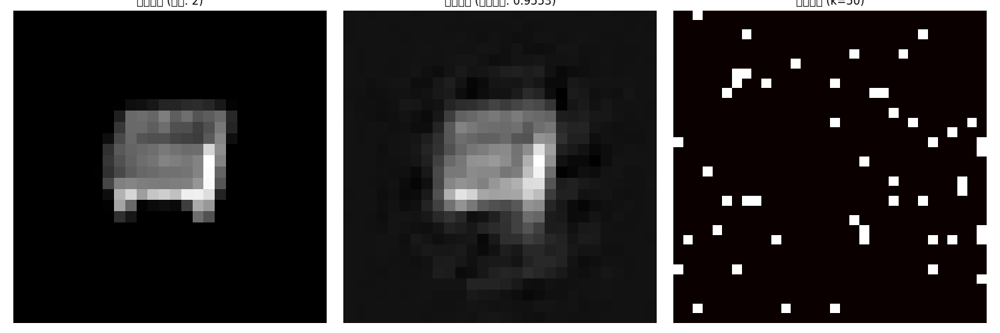
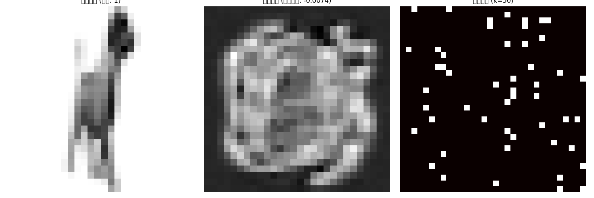
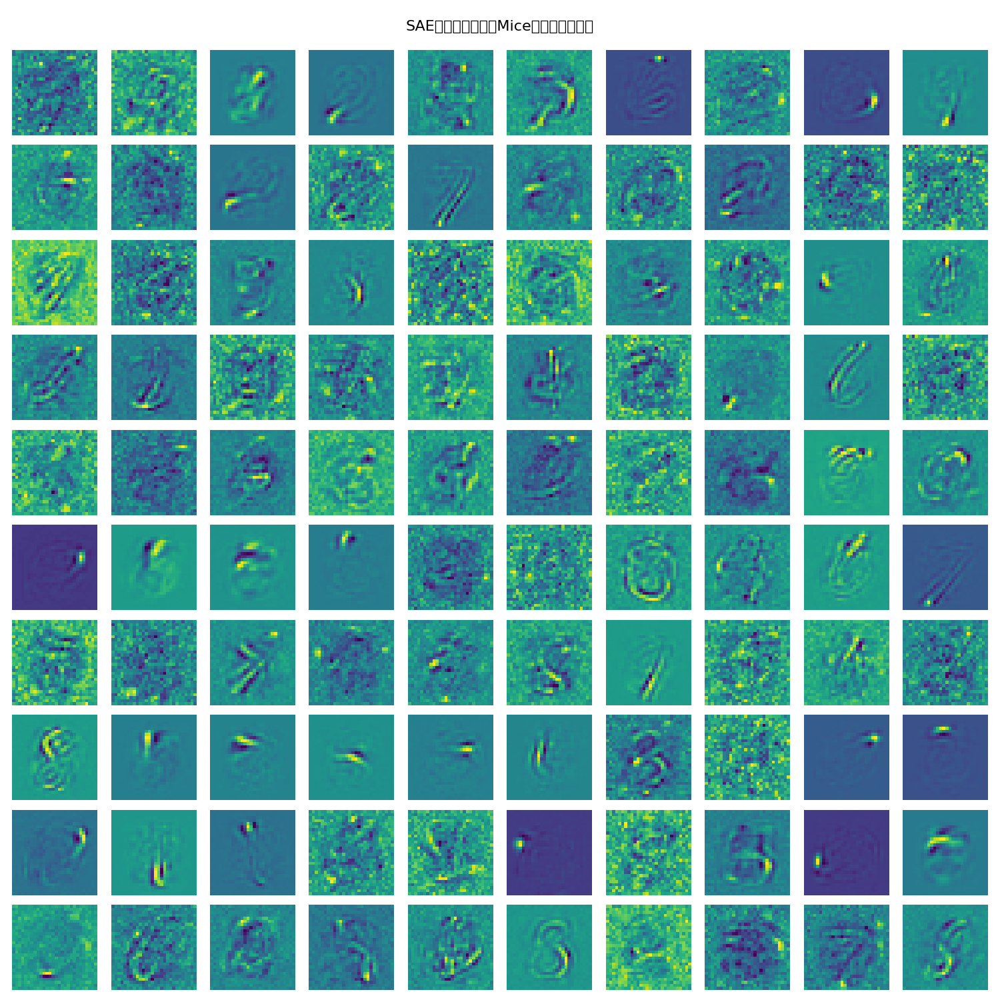
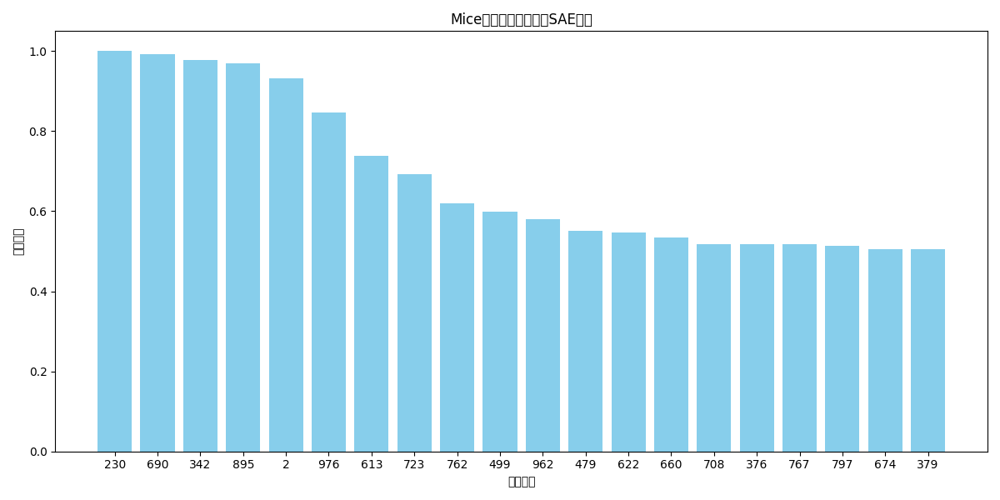
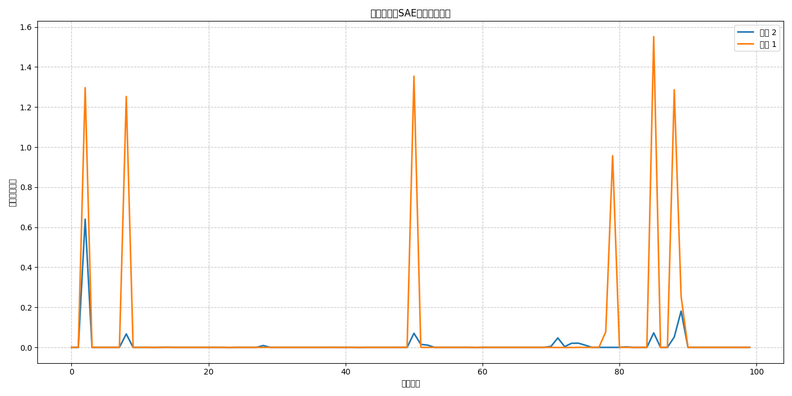

# Mice数据集上的SAE特征提取与重建实验报告

## 摘要

本报告详细描述了将预训练在MNIST数据集上的稀疏自编码器(SAE)应用于Mice数据集的实验过程与结果。实验采用了数据增强策略来扩充有限的Mice样本，并使用预训练的SAE模型进行特征提取和图像重建。结果表明，SAE在处理Mice数据集时表现出类别依赖性的重建能力，同时展示了特征激活模式与不同类别间的相关性。本报告通过多种可视化方法深入分析了SAE在跨域应用场景中的性能与特性。

## 1. 引言

稀疏自编码器(Sparse Autoencoder, SAE)是一种常用于无监督特征学习的神经网络架构。在本实验中，我们探讨了将在MNIST手写数字数据集上预训练的SAE模型应用于完全不同领域的Mice数据集的可行性与效果。这种跨域应用的研究有助于理解SAE学习到的特征的通用性与迁移能力。

Mice数据集包含两个类别的小鼠图像，样本数量有限（共39张原始图像）。我们的目标是：
1. 探究预训练SAE在新数据集上的重建性能
2. 分析SAE特征在Mice数据集上的激活模式
3. 研究不同类别间的表征差异

## 2. 方法

### 2.1 数据集处理

Mice数据集包含以下特点：
- 来自两个类别（标记为1和2）的图像
- 每个类别的样本数量有限
- 原始图像为600×600像素的PNG格式

为适应预训练的MNIST SAE模型（输入维度为784，即28×28的展平图像），我们对Mice数据集进行了以下处理：

1. **预处理**：
   - 将所有图像调整为28×28像素
   - 转换为灰度图
   - 归一化像素值至[0,1]范围

2. **数据增强**：由于原始样本数量有限，我们实施了多种数据增强策略：
   - 随机旋转（±15度）
   - 随机裁剪与调整大小
   - 水平和垂直翻转
   - 随机平移
   - 随机透视变换
   - 亮度和对比度调整

通过数据增强，我们将原始的39张图像扩充到234张，大大增加了训练样本的多样性。

### 2.2 SAE模型架构

我们使用了在MNIST数据集上预训练的SAE模型，其主要特点包括：

1. **网络结构**：
   - 输入层：784个神经元（对应28×28的展平图像）
   - 隐藏层：1024个神经元
   - 输出层：784个神经元

2. **稀疏性约束**：
   - 采用K稀疏激活机制，每次只保留前50个最大激活值
   - 稀疏度约为5%（50/1024）

3. **模型特性**：
   - 包含5个并行的SAE，但在本实验中我们主要使用第一个SAE进行分析
   - 使用绑定权重策略（解码器权重是编码器权重的转置）

### 2.3 评估指标

我们使用以下指标评估SAE在Mice数据集上的性能：

1. **重建质量**：
   - Pearson相关系数：测量原始图像与重建图像之间的相似度
   - 按类别分离的平均相关系数

2. **特征使用情况**：
   - 特征激活频率：统计每个特征被激活的比例
   - 特征激活强度：特征被激活时的平均值大小

3. **可视化分析**：
   - 重建图像对比可视化
   - 特征权重可视化
   - 稀疏激活热力图
   - 类别特征激活模式对比

## 3. 实验结果

### 3.1 重建质量分析

SAE模型在Mice数据集上的重建性能表现出明显的类别依赖性：

- **整体平均相关系数**：0.5539
- **类别1平均相关系数**：0.1849
- **类别2平均相关系数**：0.9045

这一结果表明：
1. SAE对类别2的图像具有出色的重建能力，相关系数接近0.9
2. 对类别1的图像重建效果较差，相关系数仅为0.18左右
3. 这种显著差异表明SAE学习到的特征与类别2的图像特性更加匹配

下图展示了部分原始图像与重建图像的对比：

从重建示例可以直观看出，对于类别2的图像，SAE能够保留大部分结构特征，而对类别1的图像，重建质量明显降低。

### 3.2 特征分析

#### 3.2.1 SAE特征可视化

下图展示了SAE学习到的部分特征（编码器权重可视化）：

尽管这些特征是在MNIST数据集上学习得到的，但它们展示了多种视觉模式，包括：
- 点状特征
- 线条和曲线
- 局部纹理模式
- 区域激活模式

这些基本视觉元素可以组合表示不同图像中的结构。

#### 3.2.2 特征激活频率

我们分析了Mice数据集上最活跃的特征：

观察结果显示：
1. 特征激活分布不均匀，某些特征被更频繁地激活
2. 最活跃的特征（如特征895、723、499等）在大多数图像中被激活
3. 这些高频激活特征可能捕捉了Mice图像中的常见视觉模式

#### 3.2.3 类别特征激活模式

不同类别的图像在特征激活模式上存在显著差异：

从图中可以看出：
1. 类别2的图像在多数特征上有更强的激活
2. 类别1和类别2的激活曲线在某些特征上存在明显的分离
3. 某些特征对特定类别具有选择性激活，这解释了为什么SAE对不同类别的重建质量差异显著

### 3.3 稀疏表征特性

SAE在Mice数据集上产生的表征具有以下特性：

1. **高度稀疏性**：
   - 在1024维表征空间中，只有约50个维度（<5%）有非零值
   - 稀疏激活可视化显示了表征的稀疏性模式

2. **类别区分性**：
   - 不同类别的表征在特征空间中形成了可分离的簇
   - 这种无监督学习到的类别区分性是令人注目的，因为模型从未接受过类别信息的训练

3. **特征复用**：
   - 某些特征对两个类别都有反应，但激活强度不同
   - 其他特征则表现出更高的类别专用性

## 4. 讨论

### 4.1 跨域迁移的挑战与发现

将MNIST上预训练的SAE应用于Mice数据集，我们观察到了几个重要现象：

1. **选择性重建**：
   - SAE对类别2图像的重建质量显著高于类别1
   - 这表明MNIST上学习到的特征与类别2图像的视觉特性更加匹配

2. **特征泛化能力**：
   - 尽管训练于数字识别，SAE中的某些低级特征（如边缘、纹理等）展现出了跨域泛化能力
   - 这符合深度学习中早期层特征更通用的经验观察

3. **类别特异性**：
   - 不同类别激活了不同的特征子集
   - 这种无监督发现的类别差异表明SAE能够捕捉数据内在结构

### 4.2 数据增强的影响

数据增强策略在实验中起到了关键作用：

1. **样本多样性**：
   - 增强将样本量从39张增至234张
   - 增强样本帮助更全面地探索特征空间

2. **提高稳定性**：
   - 更多样本减少了特征激活统计的方差
   - 有助于更可靠地分析特征使用模式

### 4.3 SAE的特征学习特性

通过本实验，我们观察到SAE具有以下特性：

1. **自适应特征组合**：
   - SAE通过稀疏激活机制，为每个输入自适应选择最相关的特征子集
   - 这使得有限的特征库能够表达更丰富的模式

2. **部分匹配与选择性重建**：
   - 当输入图像部分匹配预训练特征时，相应部分会被较好地重建
   - 不匹配部分则重建质量较差

3. **隐式语义捕捉**：
   - 即使没有类别标签的监督，SAE也能在特征空间中区分不同类别
   - 这表明无监督学习可以发现数据的语义结构

## 5. 结论

本实验探索了将MNIST预训练的SAE应用于Mice数据集的效果，得出以下结论：

1. **跨域应用可行性**：
   - 预训练SAE可以在不同领域的数据集上应用，但重建质量依赖于特征相似性
   - 类别2图像的高重建质量(0.9045)表明其与MNIST特征有较高匹配度

2. **特征激活模式**：
   - SAE特征在不同类别图像上展现出独特的激活模式
   - 这些差异解释了重建质量的不同，也为SAE在分类任务中的潜力提供了证据

3. **数据增强的必要性**：
   - 对于小样本数据集，数据增强是应用深度学习模型的关键步骤
   - 增强技术有效扩充了训练样本，提高了分析的可靠性

4. **稀疏表征的价值**：
   - 高度稀疏(~5%)的表征仍能保留足够信息进行重建
   - 稀疏性促使模型学习更有意义和解释性的特征

## 6. 未来工作

基于本实验的发现，我们提出以下未来研究方向：

1. **适应性微调**：在Mice数据上微调SAE模型，提高类别1的重建质量
2. **表征应用**：利用学习到的表征开发Mice图像分类器
3. **特征重要性分析**：深入研究哪些特征对区分不同类别最关键
4. **多模型集成**：结合不同预训练领域的SAE，增强特征多样性和泛化能力
5. **自适应稀疏度**：探索为不同复杂度的图像动态调整K值的策略

## 附录：实验细节

- **模型路径**：`mnist_sae_models/mnist_sae_epoch_4.pth`
- **数据增强倍率**：每张原始图像生成5张增强版本
- **设备**：CPU
- **批处理大小**：8
- **可视化结果目录**：`visualizations/mice/`
- **实验脚本**：`mice_sae_process.py`
