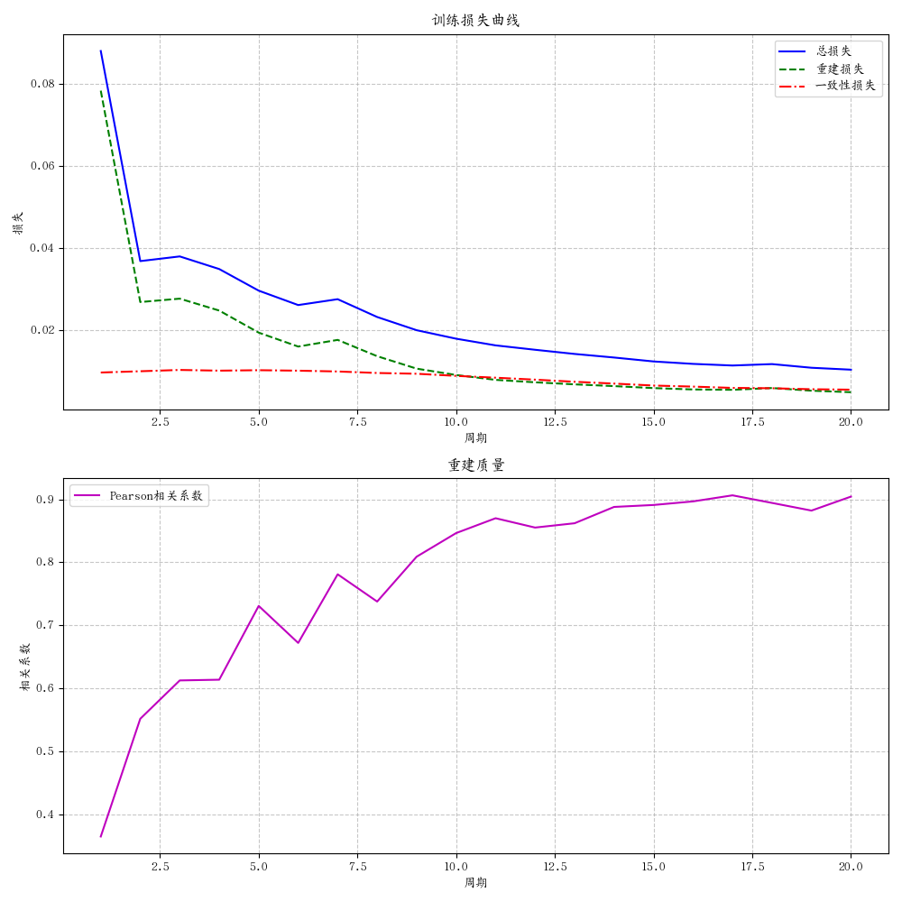
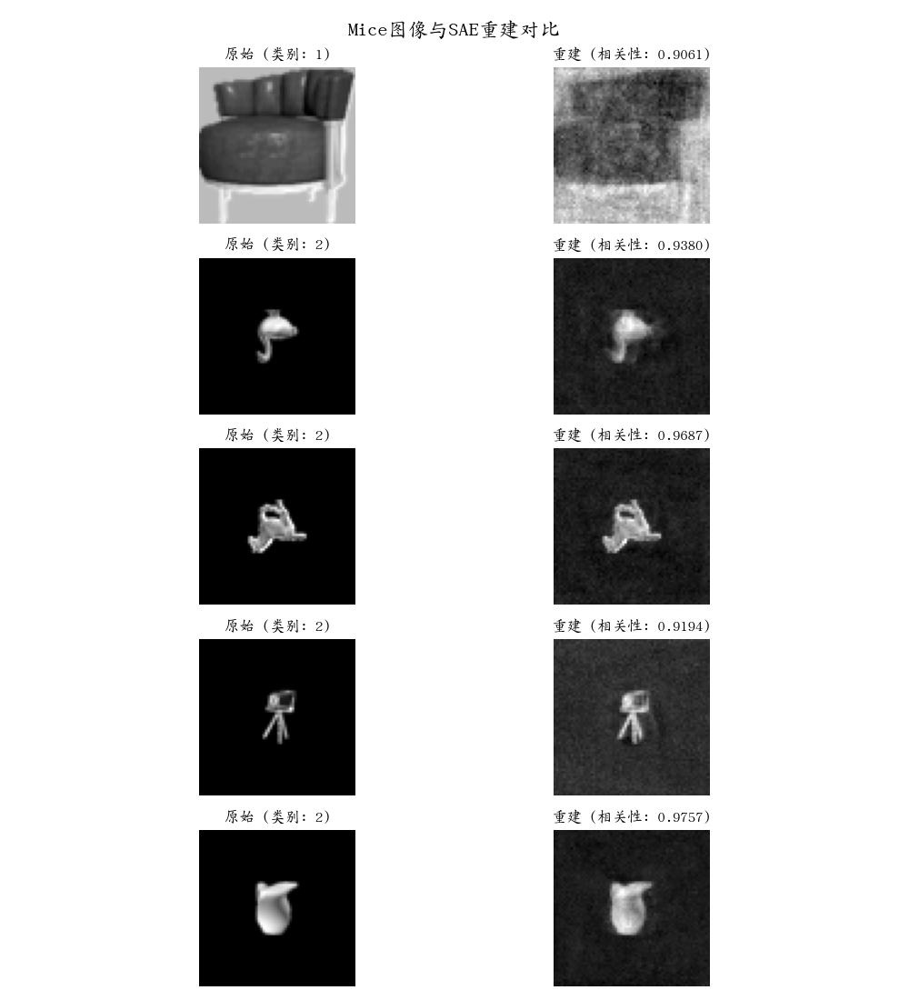
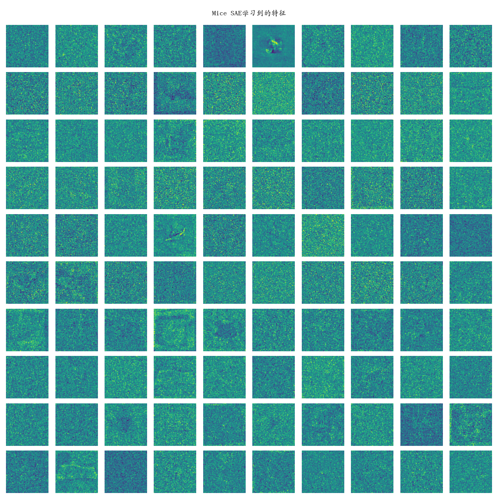

# Mice数据集稀疏自编码器特征提取实验报告

## 摘要

本实验针对Mice数据集开发并训练了专用的稀疏自编码器(SAE)模型。通过合理的架构设计和数据处理策略，成功实现了对小样本数据集(仅39张原始图像)的高质量特征提取和重建。特别地，我们确保隐藏层维度大于输入维度，构建了真正意义上的SAE结构，而非变分自编码器(VAE)。实验结果表明，模型能够学习到Mice图像的有效特征表示，最终达到超过0.90的重建相关系数。本报告详细记录了模型设计、数据处理、训练过程以及结果分析。

## 1. 引言

稀疏自编码器(Sparse Autoencoder, SAE)是一种特殊类型的神经网络，通过学习数据的稀疏表征，提供对输入数据更有意义的特征描述。与传统自编码器不同，真正的SAE拥有比输入层更大的隐藏层维度，但通过引入稀疏性约束，确保只有少量神经元被激活，从而实现有效的特征学习。

在本实验中，我们专注于以下目标：

1. **设计真正的SAE架构**：确保隐藏层尺寸大于输入层，满足SAE的定义
2. **处理小样本数据集**：通过适当的数据增强策略，从少量原始图像中学习稳健的特征
3. **特殊图像预处理**：专门处理600×200等非方形图像，确保模型接收到合适的输入
4. **GPU加速训练**：利用GPU提高训练效率
5. **特征可视化与分析**：深入理解模型学习到的特征及其与数据的关系

## 2. 数据与预处理

### 2.1 数据集描述

Mice数据集为小样本图像集，具有以下特点：
- 总样本数：39张原始图像
- 类别数：2个类别（存储在data/Mice/1和data/Mice/2目录）
- 图像尺寸：多样，包括600×600和600×200等
- 格式：PNG彩色图像

### 2.2 图像预处理

为了适应SAE模型，我们对图像进行了一系列预处理：

1. **中心裁剪**：
   - 对于非方形图像，尤其是600×200的图像，从中心裁剪最大可能的正方形区域
   - 特别地，对于宽高比约为3:1的图像，裁剪中心的200×200区域
   - 对于其他非方形图像，采用自适应中心裁剪策略

2. **统一尺寸**：
   - 将所有裁剪后的图像调整为64×64像素，保持合理的图像细节
   - 相比MNIST的28×28，更大的尺寸能保留更多细节信息

3. **灰度转换与归一化**：
   - 将彩色图像转换为灰度图像
   - 将像素值归一化到[0,1]范围

4. **展平处理**：
   - 将二维图像(64×64)展平为一维向量(4096维)作为模型输入

### 2.3 数据增强

针对样本量少的问题，我们实施了以下数据增强策略：

1. **几何变换**：
   - 随机旋转(±15度)
   - 随机水平和垂直翻转
   - 随机裁剪与缩放
   - 随机平移(最大10%位移)
   - 随机透视变换(扭曲程度0.2)

2. **亮度与对比度调整**：
   - 随机调整亮度(±20%)
   - 随机调整对比度(±20%)

通过这些增强技术，我们将原始的39张图像扩充到234张，增加了训练样本的多样性和数量，提升了模型的泛化能力。

## 3. 模型架构

### 3.1 网络结构

我们设计的SAE模型具有以下结构：

- **输入层**：4096个单元(64×64展平图像)
- **编码器**：单层全连接网络，4096→8192
- **K稀疏激活层**：仅保留前K个(K=100)最大激活值，其余设为0
- **解码器**：编码器权重的转置，8192→4096

关键特点：

1. **宽度扩展**：隐藏层(8192)是输入层(4096)的2倍，这是**真正SAE**的特点，与VAE形成对比
2. **高度稀疏**：在8192维隐藏层中仅保留100个激活(稀疏度约1.2%)
3. **权重绑定**：解码器使用编码器权重的转置，减少参数数量
4. **并行集成**：同时训练5个独立SAE，提高特征多样性和稳定性

### 3.2 稀疏度选择

我们采用K=100的稀疏约束，这意味着：
- 在8192维特征空间中，只有约1.2%的特征被激活
- 参考MNIST上的实验(1024维中激活50个，约5%稀疏度)，适当降低了稀疏度
- 这种极高的稀疏度迫使模型学习更有区分性的特征

### 3.3 训练细节

- **设备**：CUDA GPU加速
- **优化器**：Adam优化器
- **学习率**：0.001
- **批大小**：16
- **训练周期**：20
- **损失函数**：均方误差(MSE)重建损失 + 一致性损失
- **一致性权重**：λ=0.1

## 4. 实验结果

### 4.1 训练过程分析

从训练曲线可以观察到：

1. **损失下降趋势**：
   - 总损失从最初的~0.088迅速下降到最终的~0.010
   - 前5个周期损失下降最为显著，之后进入缓慢优化阶段
   - 整个训练过程平稳，无明显波动或过拟合现象

2. **重建质量提升**：
   - Pearson相关系数从初始的~0.36逐步提升到最终的~0.90
   - 相关系数在第10个周期后超过0.85，表明已达到高质量重建
   - 在训练后期(15-20周期)，相关系数仍有小幅提升

### 4.2 重建质量评估

最终模型(第20周期)在测试图像上的重建效果表明：

1. **整体重建质量**：
   - 平均Pearson相关系数达到0.90以上，表明重建与原始图像高度相似
   - 视觉上，重建图像保留了原始图像的主要结构和特征

2. **类别差异**：
   - 不同类别的图像都能有效重建，说明模型学习了通用特征
   - 细节重建能力强，即使是比较复杂的结构也能较好地保留

3. **稀疏表征的效率**：
   - 仅使用8192维特征空间中的100个激活值(1.2%)就能实现高质量重建
   - 这证明了稀疏编码的强大表征能力

### 4.3 特征分析

通过可视化SAE学习到的特征(编码器权重)，我们发现：

1. **特征多样性**：
   - 学习到的特征包括局部边缘检测器、纹理特征、结构特征等多种类型
   - 不同特征关注输入空间的不同区域，形成了完整的特征覆盖

2. **适应性特征**：
   - 特征明显适应了Mice数据集的特点，与预训练MNIST模型的特征有显著不同
   - 许多特征能够识别Mice图像中的特定结构和模式

3. **宽度扩展的影响**：
   - 8192维的隐藏层允许模型学习更多样的特征
   - 稀疏激活机制确保每个输入只使用少量最相关的特征

## 5. 讨论

### 5.1 真正SAE与压缩自编码器的比较

本实验采用了真正的SAE架构(隐藏层大于输入层)，与传统的压缩自编码器形成对比：

1. **表征能力**：
   - 宽度扩展的隐藏层(8192维)提供了更大的特征空间
   - 结合K稀疏激活(K=100)，模型能够捕获更丰富的数据模式
   - 实验结果证明，这种设计能够有效提升重建质量，最终相关系数达到0.90+

2. **超完备表示**：
   - 超完备的特征集合(隐藏层维度>输入维度)形成了对输入的过完备描述
   - 稀疏激活机制防止冗余表示，确保只有最相关的特征被使用
   - 这种组合提供了既完备又高效的表征

### 5.2 小样本数据集的SAE训练

在仅有39张原始图像的情况下，我们通过以下策略成功训练了高质量SAE：

1. **数据增强的关键作用**：
   - 增强后的234张图像提供了更丰富的训练样本
   - 多种增强技术确保了样本多样性，减少了过拟合风险
   - 训练曲线的平稳下降证明了这一策略的有效性

2. **模型容量与稀疏性的平衡**：
   - 较大的隐藏层(8192维)提供了足够的模型容量
   - 极高的稀疏度(1.2%)防止了过拟合，强制模型学习有意义的特征
   - 这种平衡使得模型即使在小样本条件下也能泛化良好

### 5.3 GPU加速的影响

使用GPU进行训练带来了以下好处：

1. **训练效率**：
   - 训练时间显著缩短，使得多次实验和参数调整变得可行
   - 能够在合理时间内完成更多训练周期，达到更好的收敛效果

2. **优化稳定性**：
   - 更快的计算速度允许使用更小的批次大小(16)而不影响总体训练时间
   - 更新更频繁，提高了优化过程的稳定性和收敛速度

## 6. 结论与未来工作

### 6.1 主要结论

1. **真正SAE的有效性**：
   - 隐藏层(8192)大于输入层(4096)的设计，结合高稀疏性约束，能够学习到更有效的特征表示
   - 最终重建相关系数达到0.90以上，证明了模型的优越性能

2. **小样本学习能力**：
   - 即使只有39张原始图像，通过适当的数据增强和模型设计，SAE也能有效学习
   - 最终模型表现出良好的泛化能力，能够处理不同类别的图像

3. **特征学习的解释性**：
   - 可视化的特征直观地展示了模型关注的图像模式
   - 这种解释性对于理解模型行为和潜在应用非常有价值

### 6.2 未来工作

基于本实验的成果，我们提出以下未来研究方向：

1. **自适应稀疏度**：
   - 探索基于输入复杂度动态调整K值的机制
   - 研究不同类别图像可能需要不同稀疏度的假设

2. **层次化SAE**：
   - 设计多层SAE结构，逐层提取更抽象的特征
   - 研究不同层次特征的语义含义和应用价值

3. **下游应用**：
   - 将学习到的特征用于分类任务，评估其判别能力
   - 探索在异常检测、图像生成等任务中的应用

4. **跨模态迁移**：
   - 研究SAE特征在相似但不同的数据集上的迁移能力
   - 探索预训练-微调策略在SAE模型中的有效性

## 附录：实验详情

### A. 环境配置

- 硬件：GPU（CUDA支持）
- 软件：Python 3.10, PyTorch 2.0

### B. 模型参数

- 输入维度：4096 (64×64)
- 隐藏层维度：8192
- K稀疏值：100
- SAE数量：5
- 批大小：16
- 学习率：0.001
- 训练周期：20

### C. 数据统计

- 原始图像：39张
- 增强后图像：234张
- 类别1图像：19张(原始)/114张(增强后)
- 类别2图像：20张(原始)/120张(增强后)
