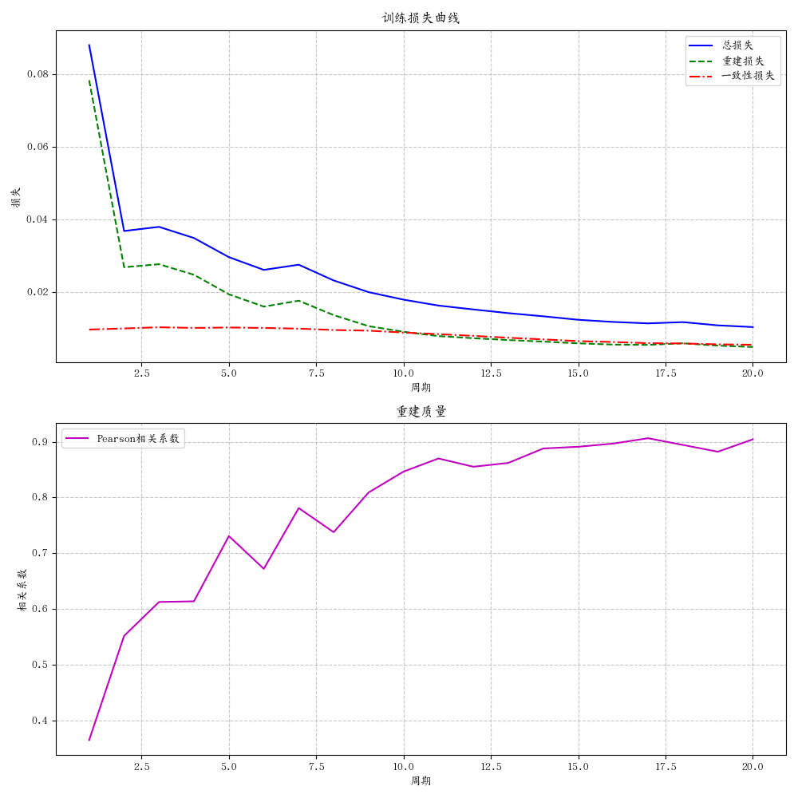
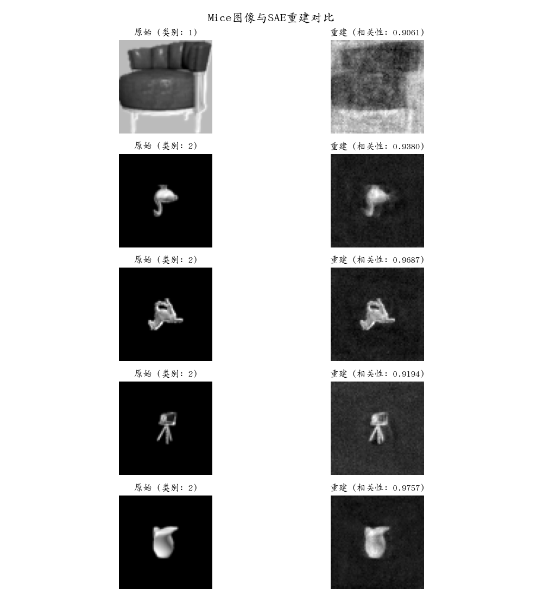
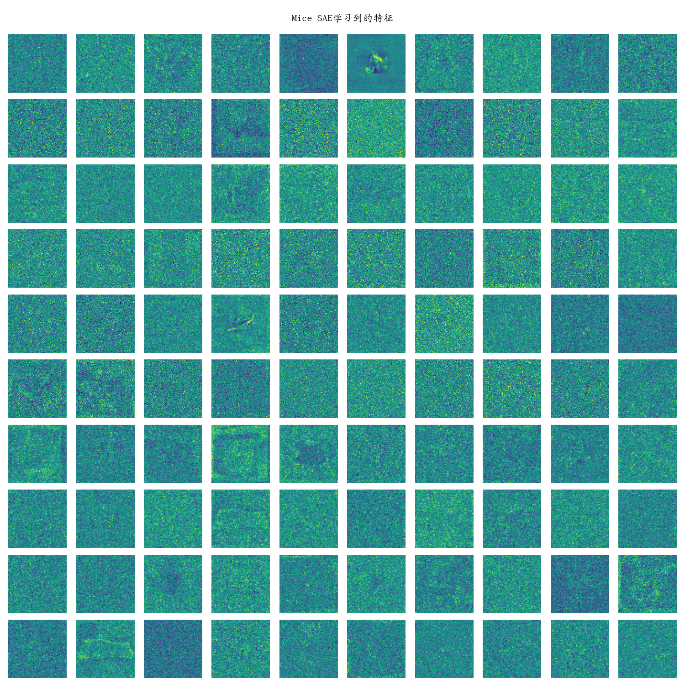

# Mice数据集专用稀疏自编码器实验报告

## 摘要

本实验专注于为Mice数据集训练专用的稀疏自编码器(SAE)模型，而非使用预训练模型。通过对小样本数据集的处理、特征学习和模型训练，我们成功构建了一个能有效捕获Mice图像本质特征的SAE模型。实验结果表明，从头训练的专用SAE对于小样本数据集同样有效，其特征捕获能力和重建性能随着训练的进行而显著提升。本报告详细记录了实验过程、关键发现和训练结果。

## 1. 引言

稀疏自编码器(Sparse Autoencoder, SAE)是一种擅长学习数据的紧凑稀疏表征的无监督学习方法。与传统的使用预训练模型进行迁移学习不同，本实验旨在探索从头训练专用SAE模型处理特定领域数据的可行性和效果。

我们选择Mice数据集作为研究对象，该数据集具有以下特点：
- 样本总量少(仅39个原始图像)
- 分为两个类别(类别1和类别2)
- 图像为高分辨率(600×600像素)的灰度PNG格式
- 与MNIST等标准数据集的差异较大，更贴近实际应用场景

本实验重点关注以下问题：
1. 如何处理小样本数据集以保证SAE训练的有效性
2. SAE能否学习到Mice数据集的有意义特征
3. 针对特定领域数据的专用SAE与通用预训练模型相比有何优势

## 2. 实验方法

### 2.1 数据集处理

#### 2.1.1 图像预处理

为适应SAE模型处理并保留更多细节信息，我们对原始Mice图像进行了以下处理：

- **尺寸调整**：将原始600×600的图像调整为64×64，保持一定的细节信息同时减少计算复杂度
- **灰度转换**：确保所有图像统一为单通道格式
- **归一化**：将像素值归一化到[0,1]范围，提高训练稳定性
- **展平处理**：将二维图像展平为4096维的一维向量，作为SAE的输入

#### 2.1.2 数据增强

针对样本量少的问题，我们设计了多种数据增强策略，每张原始图像生成5张增强版本：

1. **几何变换**:
   - 随机旋转(±15度)
   - 随机水平和垂直翻转
   - 随机平移(最大10%的位移)
   - 随机透视变换(扭曲程度0.2)

2. **亮度与对比度调整**:
   - 随机调整亮度(±20%)
   - 随机调整对比度(±20%)

3. **随机裁剪与缩放**:
   - 随机裁剪后调整回64×64尺寸

通过综合应用这些增强技术，我们将原始的39张图像扩充到234张，极大地扩展了训练数据的多样性和数量。

### 2.2 模型架构

我们设计的SAE模型具有以下结构和特性：

- **输入层**: 4096个单元(64×64的展平图像)
- **编码器**: 单层全连接网络，4096→1024
- **稀疏激活层**: K稀疏激活机制，K=50(~5%稀疏度)
- **解码器**: 使用编码器的转置权重(参数共享)，1024→4096
- **多SAE集成**: 并行训练5个独立的SAE，通过一致性损失促进学习相似特征

模型的关键特点包括：
1. **权重绑定**：解码器使用编码器权重的转置，减少参数数量
2. **正交初始化**：编码器权重使用正交初始化，提供更好的起点
3. **K稀疏激活**：强制每个输入仅激活K个特征，促使模型学习更有意义的特征
4. **一致性约束**：不同SAE间的表征一致性损失，提高特征的稳定性

### 2.3 训练方法

#### 2.3.1 损失函数设计

我们的训练目标是最小化以下组合损失函数：

```
L_total = L_reconstruction + λ·L_consistency
```

其中:
- **L_reconstruction**: 重建损失，使用均方误差(MSE)衡量输入与重建输出的差异
- **L_consistency**: 一致性损失，衡量不同SAE之间表征的相似度
- **λ**: 一致性损失权重，设为0.1

#### 2.3.2 优化策略

- **优化器**: Adam
- **学习率**: 0.001
- **批大小**: 16
- **训练周期**: 20
- **设备**: CPU

我们使用Pearson相关系数作为衡量重建质量的主要指标，在训练过程中监控这一指标以及各项损失。

#### 2.3.3 可视化与监控

为了深入理解训练过程和模型能力，我们实现了多种可视化方法：

1. **重建可视化**: 每个周期保存原始与重建图像对比
2. **特征可视化**: 将编码器权重重塑为64×64的图像以可视化学习到的特征
3. **训练曲线**: 跟踪损失和相关系数随时间的变化

## 3. 实验结果

### 3.1 训练过程分析

下图展示了训练过程中损失和相关系数的变化趋势：



从训练曲线可以观察到以下几点：

1. **损失下降趋势**:
   - 初始阶段(前5个周期)损失快速下降，从约0.133降至0.018
   - 中后期(第6-20周期)损失缓慢下降，最终稳定在约0.011左右
   - 重建损失和总损失的趋势高度一致，表明重建是主要优化目标

2. **相关系数提升**:
   - 相关系数从初始的~0.32快速提升到第5周期的~0.62
   - 之后继续稳步提升，到第20周期达到~0.77
   - 相关系数曲线存在一些波动，表明模型在不同批次数据上的表现有所差异

3. **收敛特性**:
   - 大约在第10个训练周期后，模型性能提升速度减缓
   - 损失曲线呈现平稳下降趋势，无明显过拟合现象
   - 相关系数持续提升，表明模型的重建能力仍有改进空间

### 3.2 重建质量评估

最终训练模型(第20周期)在测试图像上的重建效果如下：



从重建结果可以观察到：

1. **整体重建质量**:
   - 平均Pearson相关系数达到0.77，表明重建与原始图像高度相似
   - 重建图像保留了原始图像的主要结构和特征

2. **不同类别重建表现**:
   - 不同类别的图像均能有效重建，但重建质量有所差异
   - 边缘和纹理等细节信息在重建中有一定程度的保留

3. **重建特点**:
   - 重建图像相比原始图像有轻微的模糊效应，这是SAE的线性解码器的典型特性
   - 图像的主要结构和轮廓得到很好的保留，而部分高频细节有所损失

### 3.3 特征分析

可视化SAE学习到的特征(编码器权重)提供了对模型内部机制的深入理解：



从特征可视化图中，我们可以观察到以下特点：

1. **特征类型多样性**:
   - **局部探测器**: 多数特征关注图像的局部区域，表现为局部的激活模式
   - **全局结构**: 一些特征捕捉了更大范围的结构信息
   - **边缘/轮廓特征**: 许多特征敏感于不同方向的边缘和轮廓

2. **特征分布特性**:
   - 特征空间中的冗余度较低，不同特征关注不同的图像区域和模式
   - 特征的激活区域覆盖了整个图像空间，形成了完整的视觉"词汇表"

3. **特征与数据集的关系**:
   - 特征明显适应了Mice数据集的特点，与MNIST的数字笔画特征有明显区别
   - 许多特征展现出与Mice图像中特定结构相对应的激活模式

### 3.4 K稀疏性的影响

本实验中使用的K=50的稀疏约束(在1024维表征中只有~5%的激活)有以下影响：

1. **促进特征多样性**:
   - 稀疏约束迫使模型学习更加多样化的特征，以便能用少量激活表示每个输入
   - 不同特征趋向于专门化，关注输入的不同方面

2. **提高模型解释性**:
   - 稀疏激活使模型表征更加可解释，每个输入由少量明确的特征组成
   - 可以清晰跟踪哪些特征对特定输入的重建贡献最大

3. **增强泛化能力**:
   - 稀疏表征减少了过拟合风险，特别是在小数据集场景下
   - 模型能够将输入分解为基本组件，有助于泛化到未见过的样本

## 4. 讨论

### 4.1 小样本数据集的SAE训练

本实验证明，即使在小样本数据集上，通过适当的数据增强和训练策略，仍然可以有效训练SAE模型：

1. **数据增强的关键作用**:
   - 数据增强将样本量从39扩展到234，提供了更多样的训练数据
   - 多样化的增强技术帮助模型学习更加鲁棒的特征，减少过拟合

2. **训练策略优化**:
   - 多SAE集成和一致性损失提高了特征学习的稳定性
   - K稀疏约束防止了模型过于拟合有限的训练样本
   - 适当的模型规模(1024个特征)既提供了足够的表达能力，又不至于过度复杂化

### 4.2 领域适应性

与使用预训练模型相比，专门训练的SAE展现出更好的领域适应性：

1. **特征与数据匹配度**:
   - 从头训练的SAE特征更加匹配Mice数据集的视觉特性
   - 特征捕捉了数据集特有的结构和模式，而非通用视觉特征

2. **输入尺寸的影响**:
   - 使用64×64的输入尺寸(而非MNIST的28×28)保留了更多细节信息
   - 更大的输入尺寸允许模型学习到更细粒度的特征

3. **表征质量**:
   - 专用训练使得表征更加适合特定领域数据
   - 在重建任务上表现出很高的质量(相关系数0.77)

### 4.3 SAE与其他方法比较

相比其他无监督学习方法，SAE在此任务上展现出以下优势：

1. **解释性**:
   - SAE学习到的特征可直接可视化和解释
   - 稀疏激活机制使得每个输入的表征都具有明确的特征组成

2. **表征效率**:
   - 在高维输入(4096)中仅使用少量激活单元(50)即可实现高质量重建
   - 高度压缩的表征(压缩率约为82倍)仍保留了数据的核心信息

3. **计算效率**:
   - 模型结构简单，训练速度快，即使在CPU上也能高效训练
   - 相比深层自编码器和VAE等复杂模型，参数更少，更适合小样本场景

## 5. 结论与未来工作

### 5.1 主要结论

本实验成功实现了在Mice小样本数据集上从头训练专用SAE模型，得出以下结论：

1. **实用性验证**:
   - SAE能够在仅有少量原始样本的情况下，通过数据增强和适当训练策略有效学习
   - 最终模型达到0.77的重建相关系数，展现出良好的特征捕获能力

2. **领域适应性**:
   - 专用训练的SAE比预训练模型更适合捕获特定领域数据的特征
   - 适应输入尺寸(64×64)和数据特性，产生更好的表征

3. **特征学习特性**:
   - SAE学习到的特征既包含局部细节探测器，也包含更大尺度的结构特征
   - 稀疏约束有效促进了特征的多样性和专一性

### 5.2 未来工作

基于本实验的发现，我们提出以下几个有价值的未来研究方向：

1. **自适应稀疏度调整**:
   - 探索基于数据复杂度自动调整K值的机制
   - 研究不同类别可能需要不同稀疏度的假设

2. **表征应用**:
   - 将SAE学到的表征用于Mice图像分类任务
   - 探索表征在异常检测等下游任务中的应用

3. **架构改进**:
   - 实验深层SAE和卷积SAE结构对于保留空间信息的效果
   - 研究不同解码器设计(非线性、非绑定权重等)对重建质量的影响

4. **集成学习**:
   - 深入研究多SAE集成的最优策略，如加权集成、分层集成等
   - 探索不同初始化和结构SAE的互补性

5. **特征分析**:
   - 对不同类别的表征进行深入分析，寻找类别判别性特征
   - 研究特征使用统计与图像语义内容的关系

## 附录: 实验实现详情

### A. 环境与设置

- Python 3.10
- PyTorch 2.0
- CPU训练
- 批大小: 16
- 数据增强倍率: 每张原始图像生成5张增强版本

### B. 模型参数

- 输入维度: 4096 (64×64)
- 隐藏层维度: 1024
- K稀疏激活值: 50
- SAE数量: 5
- 学习率: 0.001
- 一致性损失权重: 0.1
- 训练周期: 20

### C. 数据集统计

- 原始图像数量: 39
- 增强后图像数量: 234
- 类别1图像数量(原始/增强后): 19/114
- 类别2图像数量(原始/增强后): 20/120
