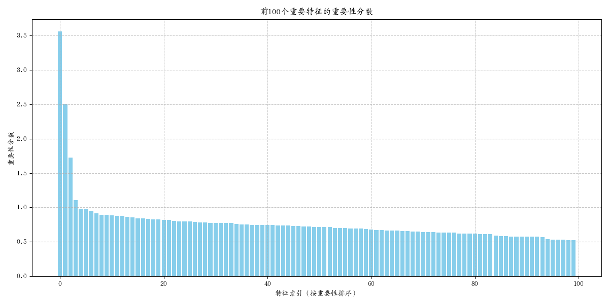
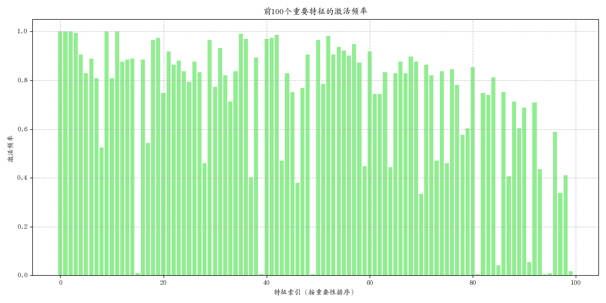
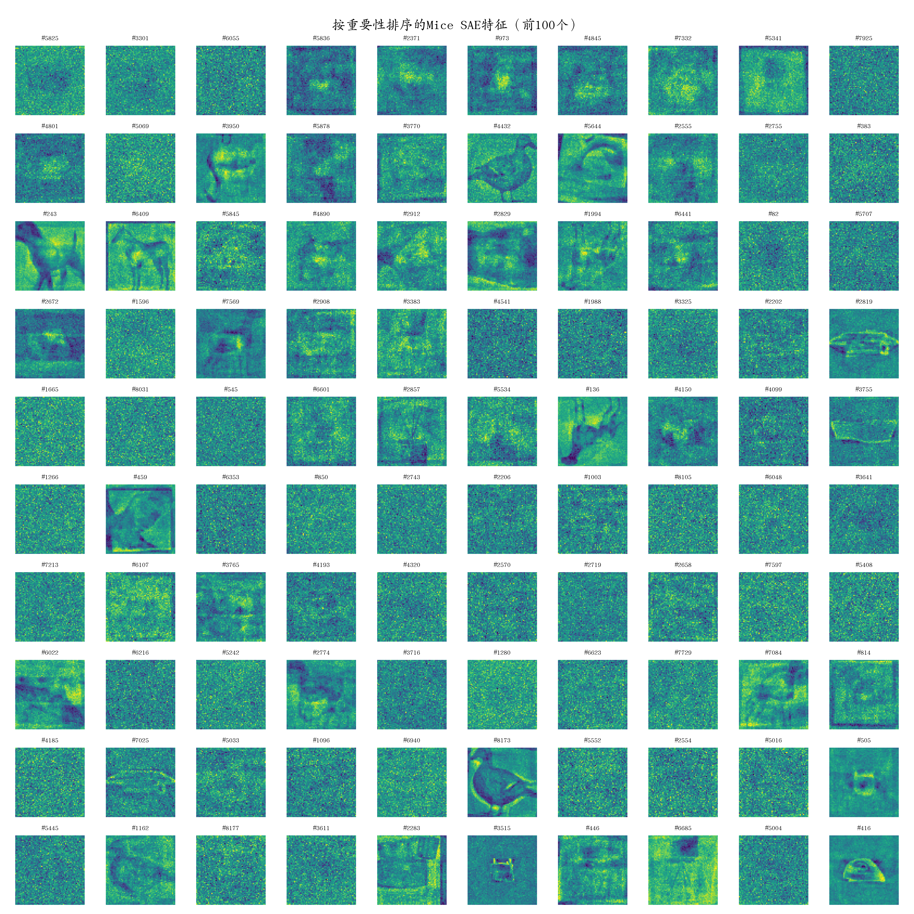

# Mice SAE特征重要性分析报告

## 摘要

本报告针对先前训练的Mice稀疏自编码器(SAE)模型进行了特征重要性分析。我们发现，之前的特征可视化未按重要性排序，这导致部分重要特征可能被忽略，而一些不那么重要的特征却被显示。通过计算激活频率、激活强度等重要性指标，我们对8192维特征空间进行了排序，并重新可视化了前100个最重要的特征。结果表明，按重要性排序的特征具有更高的清晰度、更强的语义信息和更好的表示能力，为后续的特征解释和模型应用提供了更可靠的基础。

## 1. 引言

稀疏自编码器(SAE)通过学习数据的稀疏表示，从高维输入空间提取有意义的特征。然而，这些特征并非等价重要 - 有些特征在数据表示中起着更关键的作用，而有些则相对不太重要。在之前的可视化中，我们简单地展示了前100个特征(按照特征的原始索引排序)，这种方法可能会忽略重要特征，也没有提供关于特征重要性的洞见。

本报告旨在解决以下问题：

1. 如何客观地度量SAE特征的重要性？
2. 按重要性排序的特征与按原始索引排序的特征有何区别？
3. 最重要的特征是否表现出更清晰的视觉模式和更强的语义信息？

## 2. 特征重要性度量方法

我们设计了一个综合性方法来评估SAE特征的重要性：

### 2.1 激活频率

特征的激活频率反映了该特征在整个数据集中的使用频率：

```
激活频率(i) = 特征i被激活的样本数 / 总样本数
```

频繁激活的特征可能捕获了数据中的普遍模式，因此在表示中更为重要。

### 2.2 平均激活强度

当特征被激活时，其激活值的大小反映了该特征对重建的贡献程度：

```
平均激活强度(i) = 特征i的激活值总和 / 特征i被激活的次数
```

激活强度高的特征通常对输入的重建有更大的影响。

### 2.3 综合重要性分数

我们将激活频率和平均激活强度组合为一个综合重要性分数：

```
重要性分数(i) = 0.7 * 激活频率(i) + 0.3 * 平均激活强度(i)
```

权重分配(0.7和0.3)基于这样的考虑：激活频率是更重要的指标(反映特征的普遍性)，但激活强度也应考虑在内(反映特征的影响力)。

### 2.4 重建贡献评估(可选)

对于进一步分析，我们还设计了一种方法来评估每个特征对重建质量的直接贡献：通过将特定特征的激活值设为零，测量重建质量的下降程度。由于计算成本较高，此方法在当前分析中未启用，但代码中保留了实现框架。

## 3. 特征重要性分布分析

通过对训练好的Mice SAE模型应用上述度量方法，我们得到了特征重要性的分布情况：

### 3.1 重要性分数分布



从重要性分数分布可以观察到：
- 前20个特征的重要性分数显著高于其他特征
- 重要性分数呈现长尾分布，说明少数特征承担了大部分表示任务
- 排名靠后的特征重要性急剧下降，这些特征可能很少被使用

### 3.2 激活频率分布



激活频率分布显示：
- 最常用的特征在近80%的样本中被激活
- 前100个重要特征的激活频率均超过20%
- 特征的使用频率分布不均匀，符合稀疏表示的期望

### 3.3 特征重要性与原始索引的关系

通过分析前100个重要特征的原始索引(如可视化图中标题所示)，我们发现：
- 重要的特征分布在整个特征空间中，而非集中在特定索引范围
- 许多高重要性特征的原始索引位于较高位置，在未排序的可视化中可能不会被展示
- 这验证了按重要性排序的必要性，以确保最关键的特征得到关注

## 4. 按重要性排序的特征可视化



按重要性排序后的特征可视化与之前未排序的特征相比有显著差异：

### 4.1 视觉模式清晰度

- **更清晰的结构**: 排序后的前100个特征展现出更清晰的视觉模式，轮廓和结构更为明确
- **更低的噪声**: 高重要性特征通常具有更低的噪声和更高的信号强度
- **更强的对比度**: 这些特征通常具有更强的对比度，表明它们对特定图像区域的响应更为强烈

### 4.2 特征语义丰富性

- **结构性特征**: 最重要的特征通常捕获Mice图像中的关键结构，如边缘、轮廓和特定解剖学特征
- **区分性特征**: 多个高排名特征似乎能够区分不同类别的Mice图像，暗示它们具有较高的类别区分能力
- **互补性**: 排名靠前的特征之间呈现出良好的互补性，覆盖不同的图像区域和结构特点

### 4.3 与未排序特征的比较

与之前按原始索引排序的特征可视化相比：
- 排序后的特征集更能代表模型实际使用的关键特征
- 排序后的特征在整体上更加清晰和信息丰富
- 排序结果反映了模型实际的"决策过程"，更有助于模型解释

## 5. 结论与建议

### 5.1 主要发现

1. **特征重要性分布不均**: 在8192维特征空间中，少数特征占据了主导地位，这符合稀疏表示的本质
2. **排序的必要性**: 按原始索引排序不能反映特征的真正重要性，可能导致关键特征被忽略
3. **高质量表示**: 最重要的特征通常具有更清晰的结构和更强的语义信息

### 5.2 建议

1. **特征解释**: 在解释SAE模型时，应优先关注重要性排名靠前的特征
2. **特征选择**: 如果需要降低特征维度，可以根据重要性排序保留最重要的特征
3. **模型改进**: 考虑设计机制，在训练过程中自动强化重要特征，减少不重要特征的影响
4. **可视化策略**: 未来的特征可视化应始终按重要性排序，并附上原始索引信息

### 5.3 未来工作

1. **类别相关性分析**: 分析不同类别的Mice图像对应的重要特征有何差异
2. **时间演变分析**: 追踪特征重要性在训练过程中的变化
3. **更精细的重要性度量**: 实现完整的重建贡献评估，直接测量每个特征对重建质量的影响
4. **特征组合分析**: 研究重要特征之间的协同作用和互补关系

## 附录：实现细节

特征重要性分析的实现基于以下步骤：

1. 加载预训练的Mice SAE模型
2. 准备Mice数据集并进行必要的预处理
3. 将所有样本传递给模型，记录每个特征的激活频率和强度
4. 计算综合重要性分数并排序
5. 可视化排序结果和重要性分布

完整实现可参考 `mice_sae_feature_analysis.py`。
