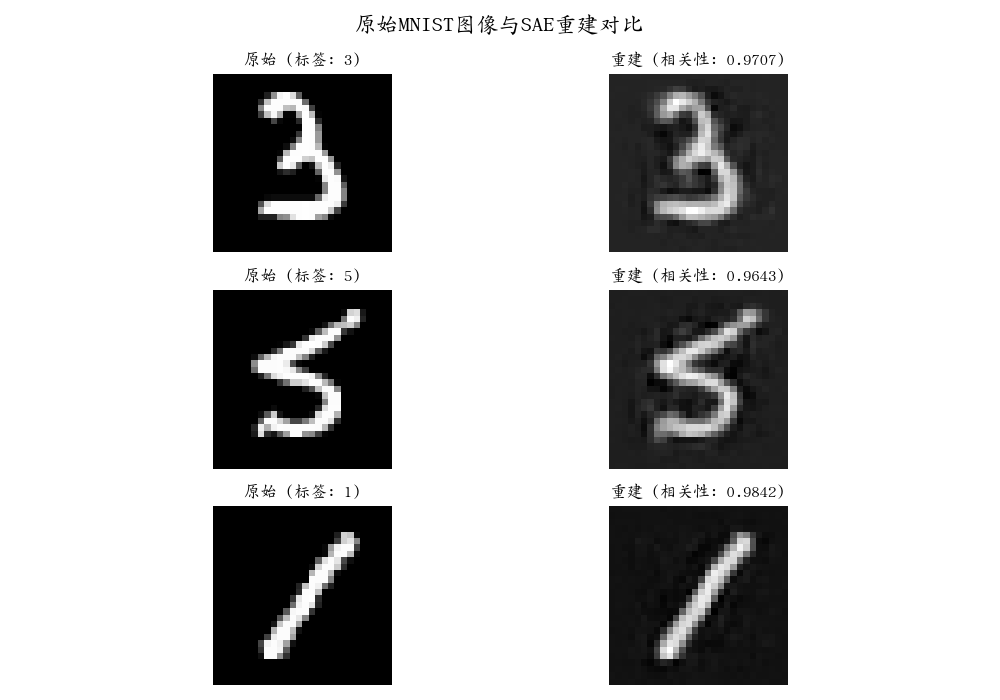
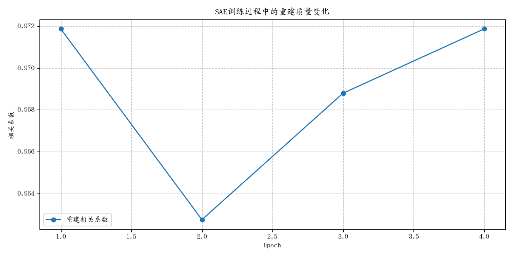

# MNIST稀疏自编码器 (Sparse Autoencoder)

## 项目说明

这个项目实现了一个应用于MNIST数据集的稀疏自编码器(SAE)。该实现使用PyTorch框架，支持在CPU和GPU上训练，并使用了混合精度训练来提高GPU训练的效率。

## 功能特点

1. **多SAE集成**: 支持同时训练多个SAE，并使用一致性损失来促进它们之间的相似性
2. **设备切换**: 支持在CPU和GPU之间灵活切换，自动适配最佳训练配置
3. **自动混合精度训练**: 在GPU上使用自动混合精度加速训练过程
4. **权重重初始化机制**: 监控特征活跃度并在必要时重初始化权重
5. **重构质量评估**: 使用Pearson相关系数评估重构质量
6. **可视化支持**: 使用WandB记录训练过程和可视化结果

## 命令行参数

```
python mnist_sae_train.py [--device {cpu,cuda}] [--analyze_loss]
```

- `--device`: 选择训练设备（CPU或CUDA）
- `--analyze_loss`: 分析初始重构损失的原因和特性

## 初始重构损失分析

当运行`python mnist_sae_train.py --analyze_loss`时，程序会分析初始重构损失为什么大约是0.08。分析结果显示：

1. **理论最小损失**: 如果所有输入都重构为均值图像，MSE损失约为0.067
2. **初始SAE损失**: 各个SAE的初始重构损失约为0.081-0.083

### 为什么初始损失是0.08?

1. **正交初始化的影响**: 
   - SAE的权重使用正交初始化，这提供了一个比完全随机初始化更好的起点
   - 正交矩阵具有保持向量长度的特性，有助于在初始阶段就有更好的重构能力

2. **MNIST数据特性**: 
   - MNIST数据集包含手写数字，主要是黑底白字的图像
   - 数据被归一化到0-1之间，大部分像素值为0（黑色背景）
   - 初始权重能够捕获到一些基本的特征，导致初始重构已经有一定质量

3. **稀疏性约束**: 
   - 我们使用k-稀疏激活，只保留top-k（在此项目中k=50）个激活值
   - 这种稀疏性约束意味着即使在训练初期，也只有一小部分神经元被激活
   - 因此初始重构损失比随机猜测要好，但比理论最优值（0.067）略高

4. **训练进展**:
   - 随着训练进行，重构损失从初始的~0.08逐渐下降
   - 相关系数从初始的~0.94上升到~0.97，表明重构质量显著提高

## GPU与CPU训练对比

### GPU训练优势

1. **速度提升**: GPU并行处理能力显著加快训练速度，特别是对于大型神经网络
2. **混合精度训练**: 自动在适当的操作中使用FP16计算，进一步提高性能
3. **内存效率**: 更高效的内存使用，支持更大的批次大小

### CPU训练优势

1. **通用性**: 在没有GPU的环境下仍然可以运行
2. **稳定性**: 避免了某些GPU相关的问题，如显存不足、驱动兼容性等
3. **更容易调试**: CPU代码通常更易于调试和分析

### 实现细节

自动设备适配逻辑：

1. 检测可用设备并自动配置：
   ```python
   self.use_amp = torch.cuda.is_available() and str(device).startswith('cuda')
   if self.use_amp:
       self.scalers = [torch.cuda.amp.GradScaler() for _ in self.base_model.encoders]
   ```

2. 根据设备选择计算路径：
   ```python
   if self.use_amp:
       # 使用CUDA的混合精度训练
       with torch.cuda.amp.autocast():
           outputs, activations, indices = self.base_model.forward_with_encoded(X_batch)
           # [...]
   else:
       # 标准CPU计算
       outputs, activations, indices = self.base_model.forward_with_encoded(X_batch)
       # [...]
   ```

3. 适配优化器步骤：
   ```python
   if self.use_amp and self.scalers[i] is not None:
       # 使用AMP和梯度缩放 (CUDA模式)
       self.scalers[i].scale(total_loss).backward(retain_graph=(i < len(self.optimizers) - 1))
       self.scalers[i].step(optimizer)
       self.scalers[i].update()
   else:
       # 标准反向传播 (CPU模式)
       total_loss.backward(retain_graph=(i < len(self.optimizers) - 1))
       optimizer.step()
   ```

## 训练结果

训练5个epoch后，各SAE的平均相关系数达到了~0.97，表明重构质量非常好。下面是详细的训练结果可视化：

### 重建质量

MNIST数据集上的SAE模型展现出了优秀的重建能力。下图展示了原始MNIST图像与SAE重建的对比：



从图中可以看出，模型能够高质量地重建输入图像，重建图像保留了原始图像的大部分细节，平均相关系数达到~0.97。

### 训练过程指标

下图展示了训练过程中重建质量（相关系数）的变化：



从训练曲线可以看出：
1. 模型在第一个epoch就达到了较高的重建质量（相关系数>0.96）
2. 随着训练的进行，重建质量进一步提升并稳定在~0.97左右
3. 训练过程整体平稳，没有出现过拟合或性能下降的情况

### 学习到的特征可视化

SAE学习到了什么样的特征？下图展示了模型编码器的权重可视化，这些权重可以被解释为模型学习到的MNIST数字的"基本组成部分"：


从特征可视化中我们可以观察到：
1. 模型学习到了多种笔画和形状特征，包括直线、曲线、圆形等
2. 这些特征具有空间局部性，表明模型能够捕获到手写数字的局部结构
3. 不同特征关注输入图像的不同区域，形成了一个全面的特征集合

## 后续改进方向

1. 探索不同的k值对特征学习的影响
2. 尝试更多的超参数优化，如学习率调度
3. 可视化学习到的特征，理解SAE捕获了哪些视觉特征
4. 将学习到的特征用于下游任务，如分类
