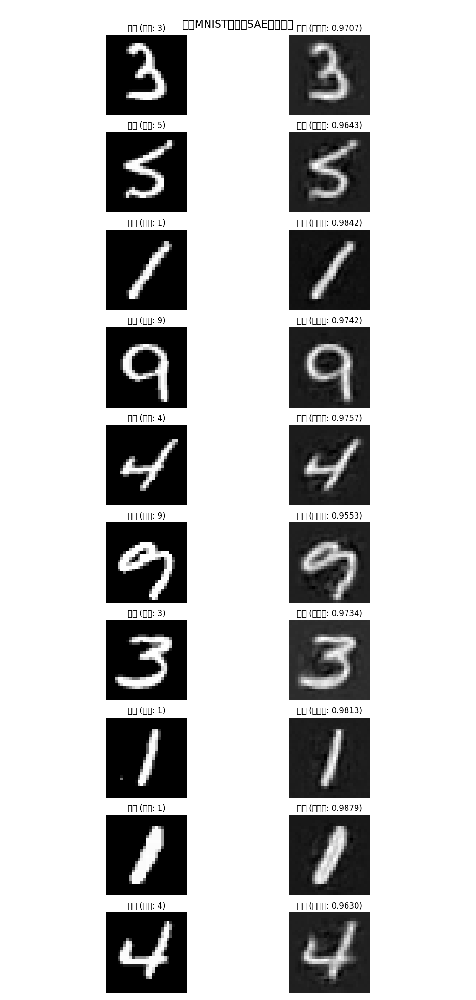
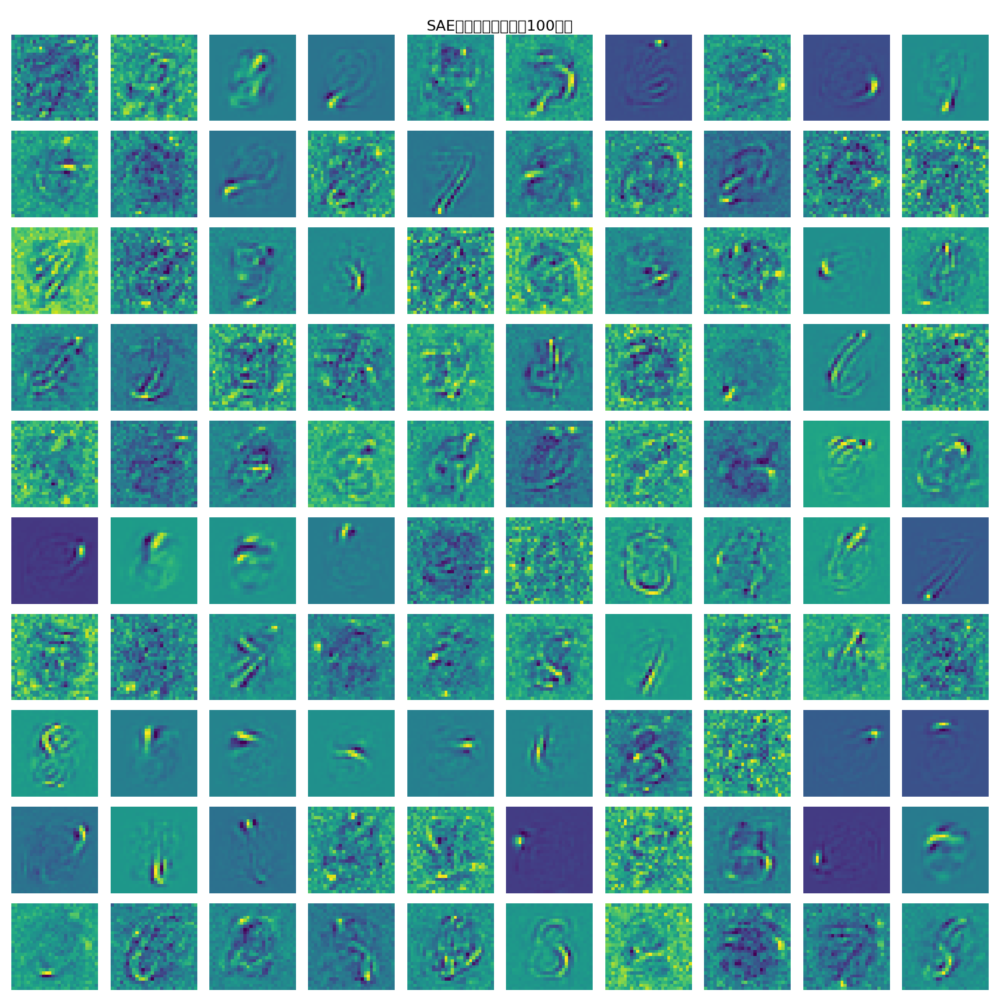
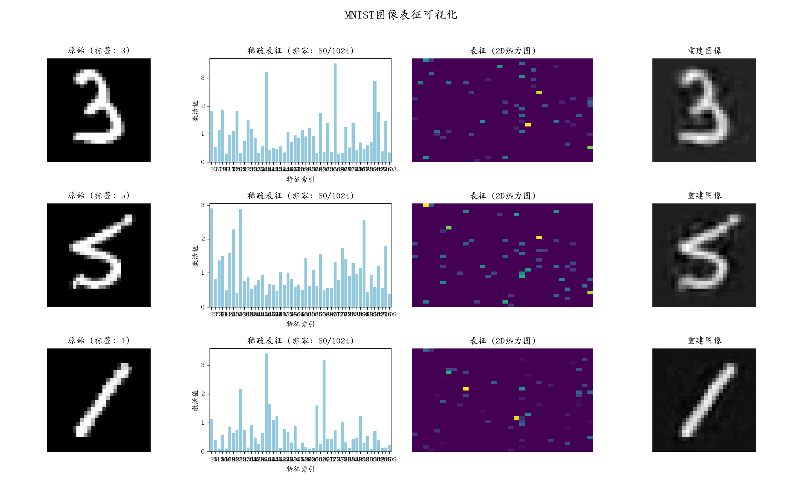

# 0430_MNIST稀疏自编码器实验报告


Lijin


## 摘要

本实验实现并分析了一个应用于MNIST数据集的稀疏自编码器(Sparse Autoencoder, SAE)模型。通过一系列实验和可视化，我们探索了SAE的特征学习能力和表征特性。实验结果表明，SAE能够学习到具有解释性的视觉特征，并产生高质量的稀疏表征，从而实现对输入图像的有效编码和精确重建。本报告详细阐述了SAE的网络结构、信息处理流程、训练方法以及可视化分析结果。

## 1. 引言

稀疏自编码器是一种无监督学习方法，旨在学习数据的紧凑而有意义的表征。与传统自编码器相比，SAE通过引入稀疏性约束，促使模型学习更加分散和解释性强的特征。这种稀疏表征不仅有助于降低数据维度、提取关键特征，还能够揭示数据的内在结构，为下游任务如分类、异常检测等提供有效支持。

本实验选择MNIST手写数字数据集作为研究对象，其包含了60,000张训练图像和10,000张测试图像，每张图像为28×28像素的灰度图，表示0-9之间的手写数字。MNIST数据集结构简单明确，成为了研究特征学习的理想基准数据集。

## 2. 网络架构与信息处理流程

### 2.1 网络架构

本实验实现的SAE模型包含以下关键组件：

1. **编码器(Encoder)**：单层全连接网络，将784维输入(28×28展平的MNIST图像)映射到1024维隐藏空间
2. **K稀疏激活层**：对编码器输出应用稀疏约束，仅保留前K个(K=50)最大激活值，其余设为零
3. **解码器(Decoder)**：单层全连接网络，将稀疏表征映射回784维输出空间以重建原始输入
4. **多SAE集成**：并行训练多个(实验中为5个)独立的SAE，通过一致性损失促进它们学习相似的特征

SAE的核心在于其稀疏激活层，它强制模型学习如何使用有限数量的特征来表示输入数据，类似于人类视觉系统在感知环境时的稀疏编码特性。

### 2.2 信息处理流程

SAE的信息处理流程可分为以下几个关键步骤：

1. **输入预处理**：
   - MNIST图像被标准化到[0,1]范围内
   - 28×28的二维图像被展平为784维向量

2. **编码过程**：
   - 输入向量x通过编码器的权重矩阵W进行线性变换：pre_activation = Wx
   - 应用K稀疏激活：选择pre_activation中最大的K个值，保持其值不变，其余设为0
   - 得到稀疏表征向量z，维度为1024，但只有K=50个非零元素

3. **解码过程**：
   - 稀疏表征z通过解码器的权重矩阵W^T(通常是编码器权重的转置)进行线性变换：reconstruction = W^T·z
   - 得到784维的重建向量，可重塑为28×28的图像
   - 注意解码器使用编码器权重的转置实现了参数共享，这种"绑定权重"策略减少了模型参数，有助于防止过拟合

4. **多SAE集成**：
   - 每个输入同时通过5个独立的SAE进行编码和解码
   - 每个SAE学习略有不同的特征表示
   - 通过一致性损失鼓励不同SAE之间学习相似的表征

此信息处理流程可以图示为：
```
输入图像(28×28) → 展平(784维) → 编码器(W) → K稀疏激活(K=50) → 稀疏表征(1024维) → 解码器(W^T) → 重建图像(784维) → 重塑(28×28)
```

## 3. 训练方法

### 3.1 训练目标

SAE的训练目标是最小化以下损失函数：

1. **重构损失**：测量重建输出与原始输入之间的均方误差(MSE)
2. **稀疏性约束**：通过K稀疏激活机制隐式实现，无需额外正则化项
3. **一致性损失**：鼓励多个SAE学习相似的表征，计算为不同SAE表征之间的均方误差

总损失函数可表示为：
```
L_total = L_reconstruction + λ·L_consistency
```
其中λ为一致性损失的权重系数。

### 3.2 优化策略

本实验采用了以下优化策略：

1. **优化器**：使用Adam优化器，学习率设为0.001
2. **批处理**：采用批大小为128的小批量梯度下降
3. **权重初始化**：使用正交初始化以提供更好的起点
4. **训练周期**：训练5个epoch，足以达到高质量重建
5. **自适应设备**：根据可用硬件自动选择CPU或GPU训练
6. **混合精度训练**：在GPU上使用自动混合精度加速训练过程
7. **权重重初始化机制**：监控特征活跃度，对长期不活跃的特征进行重初始化

### 3.3 评估指标

为评估SAE的性能，我们采用以下指标：

1. **重建均方误差(MSE)**：测量原始输入与重建输出之间的像素级差异
2. **Pearson相关系数**：计算原始输入与重建输出之间的相关性，衡量结构相似性
3. **特征激活频率**：统计每个特征在测试集上的激活频率
4. **特征可视化**：将编码器权重可视化为28×28的图像，直观评估学习到的特征
5. **表征稀疏性**：分析表征向量中非零元素的比例和分布

## 4. 实验结果与分析

### 4.1 重建质量分析



SAE在MNIST数据集上展现出了优秀的重建性能：

1. **重建精度**：模型能够高质量地重建输入图像，平均Pearson相关系数达到~0.97
2. **视觉质量**：从上图可以看出，重建图像保留了原始图像的关键结构和细节
3. **稳定性**：不同数字类别的重建质量均保持一致高水平

从训练过程来看，模型的重建质量呈现如下变化趋势：


1. **快速收敛**：模型在第一个epoch就达到了相对较高的重建质量（相关系数>0.96）
2. **稳定提升**：随着训练进行，重建质量稳步提升
3. **无过拟合**：训练曲线平稳，没有出现过拟合现象
4. **最终性能**：在第4-5个epoch时，相关系数稳定在~0.97

这些结果表明，即使使用强稀疏约束（仅激活输入空间约5%的特征），SAE仍能精确重建输入图像，证明了模型有效地学习到了数据的本质结构。

### 4.2 特征分析



通过可视化编码器权重矩阵的行向量（特征），我们可以直观理解SAE学习到了什么：

1. **基本元素**：SAE学习到了手写数字的基本组成元素，包括：
   - 直线段和曲线段
   - 圆形和环形结构
   - 点和小区域激活
   - 角落和交叉部分

2. **局部性**：大多数特征表现出明显的局部响应，即每个特征只关注图像的特定区域
   - 这种局部性使得模型能够组合特征来表示复杂结构
   - 不同特征关注输入空间的不同区域，形成完整的表示覆盖

3. **分散性**：学习到的特征分布在整个输入空间，没有明显的冗余
   - 不同特征捕捉不同类型的视觉模式
   - 特征集合形成了一个"视觉词典"，用于编码输入图像

### 4.3 表征分析



我们对SAE产生的表征进行了深入分析：

1. **稀疏表征特性**：
   - 每个输入图像的1024维表征中仅有约50个非零值（稀疏度约为5%）
   - 上图中条形图显示了稀疏表征中非零元素的位置和强度
   - 热力图直观展示了稀疏激活的空间分布

2. **表征到重建的过程**：
   - 从图中可以看到完整的编码-解码过程：原始图像→稀疏表征→重建图像
   - 即使使用极少量的激活特征，模型也能精确重建原始图像
   - 这证明了SAE学习到的表征是高效且信息丰富的

3. **特征使用统计**：


我们统计了不同特征的激活频率和强度：

   - 特征激活分布不均匀，部分特征被更频繁地激活
   - 最活跃的25个特征显示了明显的使用偏好
   - 平均激活强度与激活频率呈现一定的相关性，但并非完全一致

4. **类别特定表征模式**：


对不同数字类别的表征进行比较分析：

   - 不同数字类别在特征空间中形成了可区分的表征模式
   - 每个数字类别有其独特的"关键特征"组合
   - 例如，数字"7"强烈激活特征[230, 499, 89, ...]，而数字"2"则激活不同的特征集
   - 这种类别特定的激活模式是在没有监督信号的情况下自然形成的，展示了SAE学习到的表征具有语义意义

## 5. 讨论与结论

### 5.1 研究发现

通过对SAE在MNIST数据集上的实验，我们得出以下关键发现：

1. **高效表征**：SAE能够学习高度稀疏但信息丰富的表征，仅使用约5%的特征就能准确重建输入图像
2. **解释性特征**：可视化的特征直观可解释，表现为手写数字的基本视觉元素
3. **隐含语义**：无监督学习的SAE能够自动捕获类别相关的语义信息，不同数字在表征空间中形成可区分的模式
4. **表征分化**：SAE学习到的特征表现出明显的功能分化，有些特征适用于多个数字，有些则专注于特定数字的独特部分

### 5.2 局限性

本研究也存在一些局限性：

1. **线性重建**：SAE使用线性解码器可能限制了其捕获更复杂非线性关系的能力
2. **固定稀疏度**：使用固定的K值(K=50)可能不是所有输入的最优选择
3. **评估单一**：主要使用重建质量评估模型，未系统评估表征在下游任务中的实用性

### 5.3 未来工作

基于本研究的发现，我们提出以下几个有价值的未来研究方向：

1. **自适应稀疏度**：探索基于输入复杂度自动调整K值的机制
2. **下游任务评估**：将SAE学到的表征应用于分类、异常检测等任务，评估其实用性
3. **深度SAE**：研究多层SAE架构，以学习更加抽象和层次化的特征表示
4. **对抗鲁棒性**：分析SAE表征对抗对抗样本的鲁棒性，及其潜在的防御价值
5. **跨域迁移**：评估MNIST上训练的SAE特征对其他手写数据集的迁移能力

### 5.4 结论

本研究通过在MNIST数据集上实现和分析稀疏自编码器，展示了SAE强大的特征学习能力和表征特性。实验结果表明，SAE能够学习到具有高度可解释性的视觉特征，并产生高质量的稀疏表征，从而实现对输入图像的有效编码和精确重建。

特别值得注意的是，SAE在无监督学习的情况下，能够自动发现与数据类别相关的语义特征，这一特性使其在表征学习领域具有重要价值。通过多种可视化和分析技术，我们深入理解了SAE如何将复杂图像分解为基本组件，以及这些组件如何组合以重构原始输入。

这些发现不仅加深了我们对SAE工作机制的理解，还为开发更先进的表征学习方法提供了有价值的见解。
